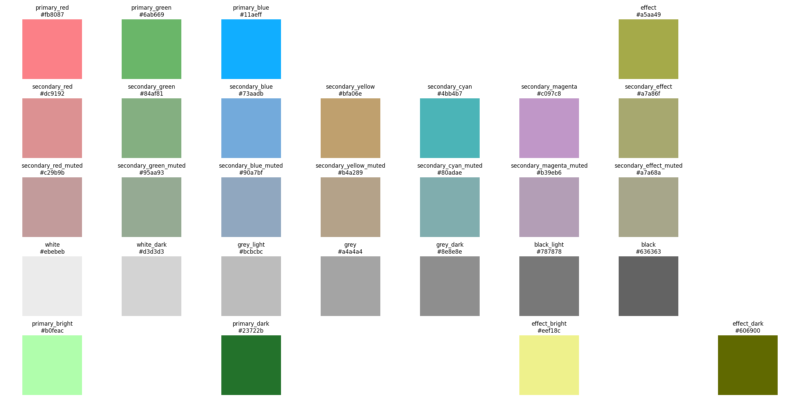

# Color Scheme Generator

This script generates a color scheme that allows to associate meaning to the colors. The higher the luminance or the chroma of the color, the more salient this color is, i.e., the more likely it is to grab the attention of the viewer. The differences in hue is maximized to avoid confusion. Furthermore the constraints of the sRGB color space are taken into account to ensure that the colors can be displayed correctly on standard screens.

## Usage

1. Install the required libraries:
   ```bash
   pip install -r requirements.txt
   ```
2. Run the script:
   ```bash
    python generate_scheme.py
    ```
3. A visualization and a json file of the generated color scheme will be saved in the `data/output` directory.

## Visualization



## Rules

1. Identify three primary colors that have the same lightness and chroma, and maximize the hue difference between them. In other words, perceptually these colors should have the same saliency in lightness and chroma. Call them `primary_red`, `primary_green`, and `primary_blue`.
2. Identify a color, that has the same lightness as the primary colors but with zero chroma. Call it `grey`.
3. Find the primary color called `primary_highlight`that can have the highest lightness and still fall into the sRGB color space (e.g., in this case this is `primary_green`) , maximize the lightness of `primary_highlight` to make it most salient. Call this colorit `primary_bright`.
4. Calculate a color called `white` that has zero chroma and the same lightness as `primary_bright`.
5. Calculate a color called `black` that has zero chroma and is the same distance from `grey` as `white` in lightness, but in the opposite direction.
6. Calculate `primary_dark` that has the same chroma and hue as `primary_bright`, but the same lightness as `black`.
7. Calculate an effect color called `effect` that has the same lightness and chroma as `primary_highlight` with a hue that is 180 degrees from the hue of `primary_highlight`. In a way, this color is the complementary color of `primary_highlight`. However, this color can fall outside of the sRGB color space. In that case, find the hue which is closest to the complementary hue that still falls within the sRGB color space.
8. Calculate `effect_dark` that has the same chroma and hue as `effect`, but the same lightness as `black`.
9. Calculate `effect_bright` that has the same chroma and hue as `effect`, but the same lightness as `white`.
10. Calculate three secondary colors that differ maximally in hue, but have the same lightness and chroma as `primary_red`, `primary_green`, and `primary_blue` and fall exactly halfway between the primary colors in hue. Call them `secondary_cyan`, `secondary_magenta`, and `secondary_yellow`. However, these colors might not fall in the sRGB color space. In that case, reduce the chroma of these colors until they fall within the sRGB color space. If the chroma is larger than 2/3 of the chroma of the primary colors, then set the chroma to 2/3 of the chroma of the primary colors.
11. Calculate a chroma adjusted version of `primary_red`, `primary_green`, and `primary_blue` called `secondary_red`, `secondary_green`, and `secondary_blue` that have the same lightness and hue as the primary colors, but the same chroma as the secondary colors.
12. Calculate a chroma adjusted version of `effect` called `secondary_effect` that has the same lightness and hue as `effect`, but the same chroma as the secondary colors.
13. Calculate a chroma adjusted version of all secondary colors with their chroma set to 1/2 of the chroma of the secondary colors. Call them `secondary_*_mutted`.
14. Calculate four additional non-chromatic colors that fall equally spaced between `black` and `grey` and `grey` and `white`. These colors have zero chroma.